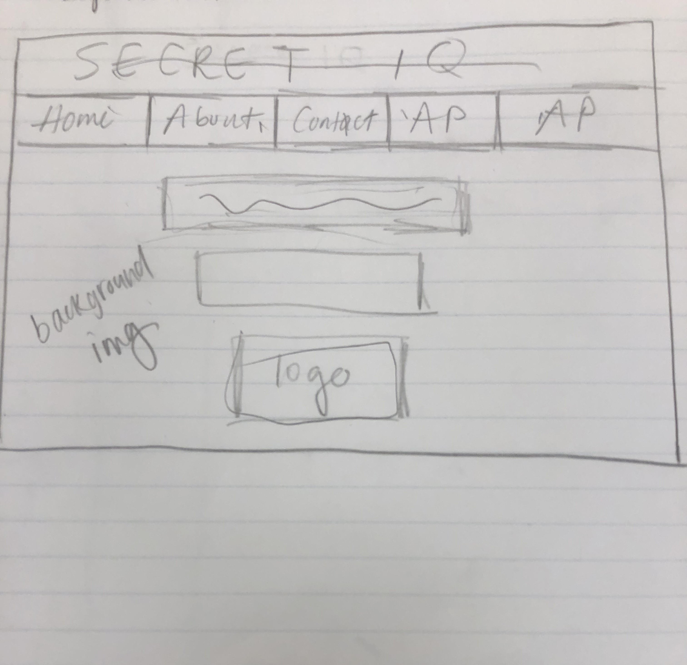
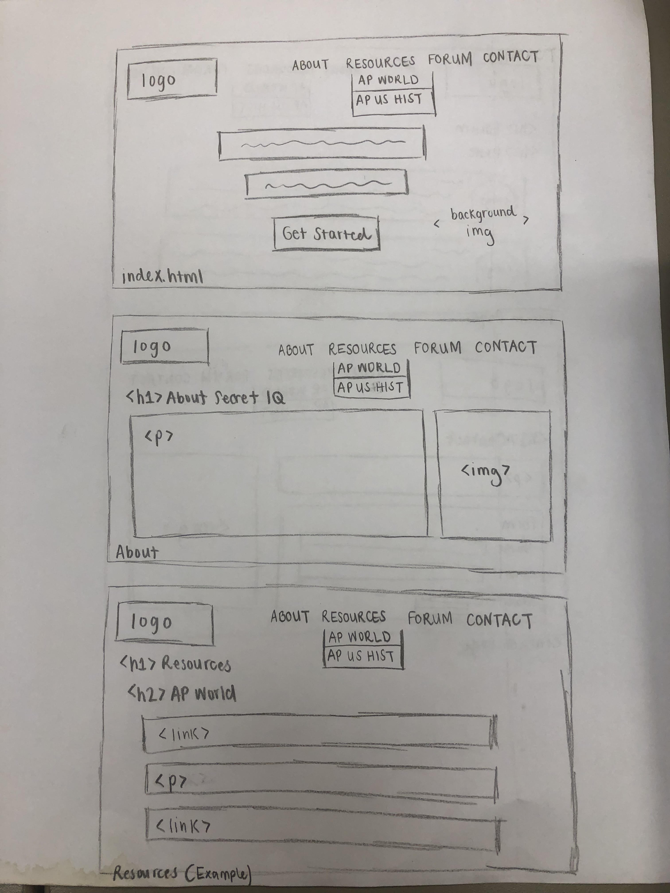
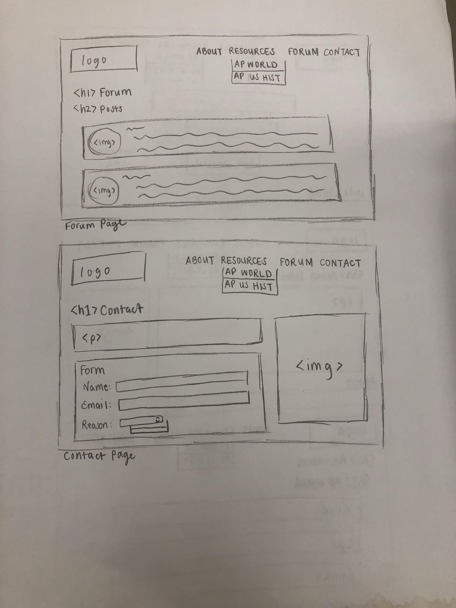

# Project 4 - Design & Plan

Your Team Name: Silver Lion

## Milestone 1: Design your Client's Site

### Client Selection (Milestone 1)

#### Client Description

[Tell us about your client. Who is your client? What kind of website do they want? What are their key goals?]

Secret IQ is a company that provides resources to AP exams for high school students, such as review books and quiz websites. Our contact, Khalid, wants us to build them a new website. It should showcase similar information to what they have now, but have a better, more user friendly design. In addition, they want a forum page for teachers to post resources. They are fine with us just providing a template of this page; Khalid said they will handle the backend. His priority is getting the design and overall planning of the new site out of the way. They also specified that they only want to showcase some of their more popular pages on the new site, so we are going to redesign the pages for AP US History and AP World History for them.

[NOTE: If you are redesigning an existing website, give us the current URL and some screenshots of the current site. Tell us how you plan to update the site in a significant way that meets the Project 4 requirements.]

We will change the design of the website to give it a more modern feel, something we and the client both feel it strongly needs. We will also add the forum and a distinct contact page to make the site more comparable to other businesses in the tutoring/education resources market. This will create a distinct new website for our client.

Dead Facebook link:

### Client Needs & Wants/Requirements (Milestone 1)

#### Purpose & Content

[Tell us the purpose of the website and what it is all about.]

The current and revised versions of the websites will be the same: to provide a platform for Secret IQ to bring attention to their affiliated products. These products include books and websites that help students prepare for the AP US History and AP World History exams.  The pages for marketing these products will have an overview of the exam as well as how the affiliated products are helpful for preparation. The site will also have a forum page for teachers to discuss what has helped their students prepare for exams to further increase the site's information on preparation for these exams.

#### Client Needs and Wants

[Collect your client's needs and wants for the website. Come up with several appropriate design ideas on how those needs may be met. In the **Memo** field, justify your ideas and add any additional comments you have. There is no specific number of needs required for this, but you need enough to do the job.]

- Needs/Wants #1
  - **Needs and Wants** [What does your client and audience need and want?]
    - The client needs a new website with a more user friendly design to increase traffic.
  - **Design Ideas and Choices** [How will you meet those needs and wants?]
    - Using principles learnt from class, we will improve the aesthetics of the site via application of proper contrast, intuitive placement of links and information, and user testing. By doing this, we will create a great experience for the website's users, fulfilling the client's need.
  - **Memo** [Justify your decisions; additional notes.]
    - The current website needs better design in several areas. For example, the navigation bar looks outdated, and its text changes to an off putting yellow when hovered over. We will use better contrasting colors and a more modern looking navigation bar as one of our changes to achieve this goal. A higher quality website will lead to more users going to and exploring the website since they will feel that it is more professional.

  - Needs/Wants #2
    - **Needs and Wants** [What does your client and audience need and want?]
      - The client wants a new page for a forum for teachers to share AP exam education materials.
    - **Design Ideas and Choices** [How will you meet those needs and wants?]
      - We will create a page for the posts to go, as well as a sample design of a post or two. We will follow a style similar to social media for this page while fitting it in with the new overall theme of the website.
    - **Memo** [Justify your decisions; additional notes.]
      - While we cannot create the backend for such a forum, our client informed us that simply having the page created would be helpful. Khalid said that having a template to work off of when they implement the rest of the forum would be a great time saver.

  - Needs/Wants #3
    - **Needs and Wants** [What does your client and audience need and want?]
      - The client wants a professional contact page that is easy for students and potential business partners to find.
    - **Design Ideas and Choices** [How will you meet those needs and wants?]
      - We are going to place navigation to the contact page on the navigation bar. In addition, we are going to revise their contact form to include a reason for contacting. This form will be styled with the lessons learnt from class such as proper alignment to make it easy to use for the website's audience.
    - **Memo** [Justify your decisions; additional notes.]
      - The current contact page takes several clicks to find; this could frustrate users and result in lost business. In addition, by adding a reason for contacting Secret IQ, they can better filter responses to the team member responsible for handling that area.

#### Client Meeting Notes

[By this point, you have met once with your client to discuss all their requirements. Include your notes from the meeting, an email they sent you, or whatever you used to keep track of what was discussed at the meeting. Include these artifacts here.]

Our meeting with Khalid took place on 11/14/2018 at 7PM in 110 Carpenter Hall. We started off with introducing ourselves, and Khalid gave us a walkthrough of the website. He explained that the design and overall structure needs work. He also explained how their was a link to a defunct business in the navigation bar that needs to be deleted. We then asked him a bit more of what exactly he wanted: who will be using the website, what content we should keep/discard, and his expectations of what can be accomplished. He told us that students would be the primary users, but also that potential clients looking to advertise their products will visit the site as well. Furthermore, he asked us to create a forum page for teachers to share resources. We explained how we can create the page, but that he would need to implement the backend himself, which he said was fine. The meeting then concluded at 7:18.

### Target Audience (Milestone 1)

#### Target Audience(s)

[Tell us about the specific audience(s) for this website.]
The target audience for this site is high school students who need guidance and resources to help them prepare for and do well on their AP exams. This may include students who don't have the money to hire expensive tutors and review material. In addition, the website will also be used by teachers and businesses that want to partner with Secret IQ to showcase their advice and products on the website. Lastly, the website will be used by tutors to help their students improve.

#### Target Audience Needs

[What are the needs of your target audience(s)? Note that these are probably *not* the needs of your client.

The needs of the target are as follows:
1) A neat website that organizes study material in an understandable way  
2) A way to contact instructors for further guidance
3) Links to practice exams by the College Board
4) A list of AP Exams on its own page
5) A site that is simple to use and aesthetically pleasing
6) Free and advertised study material

### Initial Design (Milestone 1)

#### Content

[Place your content in the **content** folder. NOT in the documents folder.]

[Note any content (e.g., text, image) that you need to make/get from the client here.]

#### Content Organization, Information Architecture, and Navigation

[Lay out the plan for how you'll organize the site and which content will go where. Plan out the navigation for the site. Document your process for organizing the content.]

[Note: As with the Needs and Wants table, there is no specific amount to write here. You simply need enough content to do the job.]

Example:
- **Navigation**
  - Home (logo)
  - About
  - Resources
    - AP US History
    - AP World History
  - Forum
  - Contact

- **Content** (List all the content corresponding to main navigation and sub-categories.)
  - *Home*: Has a simple heading and a subheading with a tagline. Very clean, just a background image and the nav bar.
  - *About*: Gives the website's purpose, mission, and background information.
  - *AP US History*: Has study tips and guides for the AP US History exam
  - *AP World History*: Has study tips and guides for the AP World History exam
  - *Forum*: Is a place for teachers to make posts and exchange ideas about AP studying and teaching.
  - *Contact*: Has a form for people to contact the company with any comments or questions.

- **Process**
  - We based our organization off of the client's current webpage. We took the elements that we liked and restructured and rebranded. We kept the about page and the logo that linked to the home page. We rebranded the AP Tests page to be called Resources and concentrated our efforts on AP US History and AP World History, as to the client's request. Furthermore, we added a contact page and a forum, which the client requested as well.

#### Sketches

[Include exploratory idea sketches of your website.]

[Include sketches of your finalized design.]

#### Interactivity

[What interactive features will your site have? Describe how the interactivity connects with the needs of the clients/target audience.]
- The interactive features we would like is to be able to validate user input for a form in the contact and forum sections of our website. This would include proper error messages being shown when there are not proper inputs being given to the form and allowing a POST request to be successful when the form is valid. This meets the needs of the client because part of having a contact page that is seemingly more professional means to have a contact page that should only work when the right input is submitted. The forum page gives a stepping stool to the client to actually implement this forum page on their own, which they know they will have to do. It would come off as unprofessional to allow faulty inputs to be submitted, which is the opposite of what the client would like.
- The navigation bar will have a drop down that reveals two options for AP World and AP US History pages when Resources is clicked.

#### Additional Comments (Milestone 1)

[If you feel like you haven't fully explained your design choices, or if you want to explain some other functions in your site (such as special design decisions that might not meet the Project 4 requirements), you can use this space to justify your design choices or ask other questions about the project and process.]

N/A

## Milestone 2: Draft of Coded Website

### Interactivity (Milestone 2)

[Write your interactivity pseudocode here. Remember you must use two conditional statements.]

For AP.js referring to the Resources tab dropdown:
if the resources tab is clicked and the dropdown is currently not showing
  show the links to the APUSH page and the AP World History Page
if the resources tab is clicked and the dropdown is currently showing
  hide the links to the APUSH page and the AP World History Page

For forum.js:
if first name is not valid:
  show first name error message
if last name is not valid:
  show last name error message
if email is not valid:
  show email error message
if school is not valid:
  show school error message
if message is not valid:
  show message error message
else:
  display success message

For contact.js:
if name is not valid (empty),
  show name error message to show user that field is required
if email is empty,
  show email error message that says you must enter your email address
if email is not a valid email address,
  show email error message that says you must enter a valid email address
else:
  display success message

### Tasks (Milestone 2)

[You will need to come up with at least 4 tasks. List your tasks here. You *do not* have to do user tests yet.]

Target Audience #1: Student
Task 1: When is the next AP World History Exam?

Task 2: What is Secret IQ's Motto?

Task 3: Post a non-empty message on the Forum with your name, email and school.

Task 4: Request to be contacted in order to find an AP tutor/ Request to be contacted with a business inquiry.

### Client Meeting (Milestone 2)

[By this point, you have met once with your client a second time to discuss your initial design. Include your notes from the meeting, an email they sent you, or whatever you used to keep track of what was discussed at the meeting. Write a few sentences about the design feedback you received from your client.]

We started a video call with Khalid at 8:55PM on 11/18/2018. We first explained to him our thoughts on what the site should be. We showed him our sketches and pulled up a sample color scheme that we wanted to use for the site. We also explained why these colors work and why we wanted to change the color of the logo. Khalid was receptive to our proposals. He said that he liked our vision to modernize the site and that our reasons for changing the logo, namely the poor contrast, made sense. We concluded by agreeing to send him screenshots of all pages of the site when we finish the styling. The call ended at 9:15PM.

### Additional Comments (Milestone 2)

[If you feel like you haven't fully explained your design choices, or if you want to explain some other functions in your site (such as special design decisions that might not meet the Project 4 requirements), you can use this space to justify your design choices or ask other questions about the project and process.]

Things to Do:
- Add interactivity in javascript for the form
- Complete the CSS styling (make it cohesive for all pages)
- Styling Responsibilities
    - Dray: Text Body (AP Pages)
    - Rami: Navigation Bar
    - Karen: Color Scheme/Font
    - Ciarra: Forum and contact
- Finish the user testing tasks
    - Rami: Tasks 1-3
    - Ciarra: Task 4

Color scheme inspired by https://www.canva.com/learn/website-color-schemes/ #3, muted tones.

## Milestone 3: Presentation & Demo Ready Draft
Presentation Materials:
Old Website Link: http://secretsmartiq.com/

### Additional Comments (Milestone 3)

[If you feel like you haven't fully explained your design choices, or if you want to explain some other functions in your site (such as special design decisions that might not meet the Project 4 requirements), you can use this space to justify your design choices or ask other questions about the project and process.]

- We added a navigation bar with a more solid color and the reason that we did
this is because the words of the navigation were getting drowned out by the
picture that was on index page. Because of which, we needed to take into
account how we might expand the color of the navigation when we click on the
resources tab. Thus, we added an interactivity portion to the bar where once
you click on the resources tab, then the nav bar becomes bigger in order to fit
the sub navigation items.

## Final Submission: Complete, Polished, and User Tested Website

### Changes Based on Presentation (Final Submission)

[What changes did you make to your plan or design based on your peers' feedback?]

We received a lot of valid feedback detailed below:
Feedback #1
- The color scheme/theme was not appropriate for the academic content that we presented on the site
- Changes Made:

Feedback #2
- There was not any interactivity, aside from the forms and their feedback
- Changes Made:
    - Added auto scrolling
    - Created a dropdown navigation bar (resources tab)
    - Made the tab highlight when hovering over it on the navigation bar
    - Added the pencil animation on the navigation bar to indicate the page that the user is currently on
    - Created a slideshow of AP preparation materials
Feedback #3
- There were not a lot of images used on the site
- Changes Made:
    - Image slideshow
Feedback #4
- The font and design elements were plain
- Changes Made:
    - Changed the font to a more academic-themed style
    - Altered the placement of the navigation bar and included animation/interactivity

### User Testing (Final Submission)

#### Participant 1

1. Sophia Zhang is a sophomore in college who has a younger sister in high school. She is helping her sister prepare for her first AP exam in the spring, AP World History. She is helping her sister gather study materials and make a study plan.

2. Does your participant belong to your target audience of the site? Yes

[If “No”, what’s your strategy of associating the user test results to your target audience’s needs and wants? How can your re-design choices based on the user tests make a better fit for the target audience?]

[Report the results for your user's performance on each of your tasks. You should **describe the task** you ask the user to complete, explain **what the user did**, describe the user's **reaction/feedback** to the design, **reflect on the user's performance**, determine what **re-design choices** you will make. You can also add any additional comments in the **memo** field.]

Format:
- Task #1
  - **Task Description** (What was the task for this user?)
    - When is the next AP World History Exam?
  - **How did the user do? Did that meet your expectation?**
    - User first clicked the 'Let's get started!' button which took her to the about page. She then hovered over resources and selected AP World History. She looked at the page and saw the next exam date at the bottom. This met my expectations.
  - **User’s reaction / feedback to the design** (e.g., specific problems or issues found in the tasks)
    - The user suggested changing the Resource tab to be called 'AP Exams' due to her initial confusion.
  - **Your reflections about the user’s performance to the task**
    - Although the user initially struggled, she was able to complete the task in a short amount of time. Because of this, I do not think it is necessary to make changes.
  - **Re-design choices**
    - None
  - **Memo** (Justify your decisions; additional notes.)
    - Since we do not have full AP exams on our page, I do not think it would be appropriate to rename the tab 'AP Exams' as that may be misleading.

    - Task #2
      - **Task Description** (What was the task for this user?)
        - What is Secret IQ's Motto?
      - **How did the user do? Did that meet your expectation?**
        - The user quickly navigated to the about page and found the motto. This met my expectations.
      - **User’s reaction / feedback to the design** (e.g., specific problems or issues found in the tasks)
        - The user did not have any issues with the design.
      - **Your reflections about the user’s performance to the task**
        - Since the user completed the task well, the about page is user friendly.
      - **Re-design choices**
        - None
      - **Memo** (Justify your decisions; additional notes.)
        - N/A

    - Task #3
      - **Task Description** (What was the task for this user?)
        - Post a non-empty message on the Forum with your name, email and school.
      - **How did the user do? Did that meet your expectation?**
        - The user initially went to the contact page and filled that out. This was because she misheard my prompt. This initially surprised me since I wasn't sure what she was doing.
      - **User’s reaction / feedback to the design** (e.g., specific problems or issues found in the tasks)
        - After I corrected the user about the task, she did not have any issues or problems.
      - **Your reflections about the user’s performance to the task**
        - After her initial confusion, the user performed well.
      - **Re-design choices**
        - None
      - **Memo** (Justify your decisions; additional notes.)
        - There are no changes needed as the user completed the task.

  - Task #4
    - **Task Description** (What was the task for this user?)
      - Request to be contacted in order to find an AP tutor.
    - **How did the user do? Did that meet your expectation?**
      - The user went to the Contact page quickly and filled it out. This met my expectations.
    - **User’s reaction / feedback to the design** (e.g., specific problems or issues found in the tasks)
      - The user did not have any specific problems or issues with the task. She was able to complete it without any issues.
    - **Your reflections about the user’s performance to the task**
      - Since the user did not have any problems, the contact page is user friendly.
    - **Re-design choices**
      - None
    - **Memo** (Justify your decisions; additional notes.)
      - N/A

#### Participant 2

1. Who is your participant, e.g., what is their name, where do they comes from, what is their job, characteristics, etc.?
Anthony Peng is a sophomore studying business at Cornell. He is 19 and is from New York, NY. He tutors for AP exams back home.

2. Does your participant belong to your target audience of the site? (Yes / No)
Yes

[If “No”, what’s your strategy of associating the user test results to your target audience’s needs and wants? How can your re-design choices based on the user tests make a better fit for the target audience?]

- Task #1
  - **Task Description** (What was the task for this user?)
    - When is the next AP World History Exam?
  - **How did the user do? Did that meet your expectation?**
    - First he clicked the about page and read it for a bit
    - He clicked about again
    - Eventually clicked on resources, then AP World and found the answer
  - **User’s reaction / feedback to the design** (e.g., specific problems or issues found in the tasks)
    -He said that the design looked good but that it wasn't clear where to look.
  - **Your reflections about the user’s performance to the task**
    - It took Anthony a bit longer than desired to find the information, showing more emphasis needs to be placed on what's in resources.
  - **Re-design choices**
    - The first sentence on the about page now explicitly mentions the AP exams.
  - **Memo** (Justify your decisions; additional notes.)
    - This will help eliminate confusion about where information about AP exams is on the site since that wasn't mentioned clearly before.

    - Task #2
      - **Task Description** (What was the task for this user?)
        - What is Secret IQ's Motto?
      - **How did the user do? Did that meet your expectation?**
        - First clicked on the about page
        - Read for a few seconds before finding motto.
      - **User’s reaction / feedback to the design** (e.g., specific problems or issues found in the tasks)
        - He said that this task was very straight forward and easy to complete.
      - **Your reflections about the user’s performance to the task**
        - He completed the task in satisfactory time with little difficulty.
      - **Re-design choices**
        - No changes were made.
      - **Memo** (Justify your decisions; additional notes.)
        - Because Anthony didn't struggle at all we are confident in the design.

    - Task #3
      - **Task Description** (What was the task for this user?)
        - Post a non-empty message on the Forum with your name, email and school.
      - **How did the user do? Did that meet your expectation?**
      - Clicked on forum
      - Scrolled down and filled out information
      - Submitted with no errors
      - **User’s reaction / feedback to the design** (e.g., specific problems or issues found in the tasks)
        - He said that the design and submission method was easy to follow
      - **Your reflections about the user’s performance to the task**
        - Anthony filled out the form with little trouble which bodes well for its usability.
      - **Re-design choices**
        - No changes
      - **Memo** (Justify your decisions; additional notes.)
        - Based on Anthony's interactions, it appears that the forum form is user friendly.

  - Task #4
    - **Task Description** (What was the task for this user?)
      - Request to be contacted with a business inquiry.
    - **How did the user do? Did that meet your expectation?**
      - Clicked on contact page
      - Looked over page for a minute before filling form out
      - Was able to find appropriate reason in drop-down
      - Submitted with no errors
    - **User’s reaction / feedback to the design** (e.g., specific problems or issues found in the tasks)
      - Anthony felt that this was also easy and simple to fill out.
    - **Your reflections about the user’s performance to the task**
      - As expected, Anthony filled out the form with no issues.
    - **Re-design choices**
      - No changes.
    - **Memo** (Justify your decisions; additional notes.)
      - Like the forum form, the contact form was filled out as easily as we hoped, so no changes are necessary.
[Include evidence of your user testing process.]

#### Participant 3

1. Who is your participant, e.g., what is their name, where do they comes from, what is their job, characteristics, etc.?
Sungjae Ahn is also a sophomore studying business at Dyson here at Cornell. He is from Jericho, Long Island. He says he has tutored in the past and is considering tutoring for AP exams when he goes home for winter break.

2. Does your participant belong to your target audience of the site? (Yes / No)
Yes

[If “No”, what’s your strategy of associating the user test results to your target audience’s needs and wants? How can your re-design choices based on the user tests make a better fit for the target audience?]

- Task #1
  - **Task Description** (What was the task for this user?)
    - When is the next AP World History Exam?
  - **How did the user do? Did that meet your expectation?**
    - Clicked 'Get Started'
    - Scrolled up and down
    - Clicked Resources, AP World
    - Found information
  - **User’s reaction / feedback to the design** (e.g., specific problems or issues found in the tasks)
    - Sungjae said he knew to go to resources after seeing the sentence that was added after the prior participant's test.
  - **Your reflections about the user’s performance to the task**
    - It was good to see that the added text was helpful and added a bit more clarity to users as to where to look.
  - **Re-design choices**
    - No changes.
  - **Memo** (Justify your decisions; additional notes.)
    - There was no problem with the design for this task.

    - Task #2
      - **Task Description** (What was the task for this user?)
        - What is Secret IQ's Motto?
      - **How did the user do? Did that meet your expectation?**
        - Clicked About
        - Found the motto right away
      - **User’s reaction / feedback to the design** (e.g., specific problems or issues found in the tasks)
        - He said it was quite clear since the motto is in a distinct box at the top.
      - **Your reflections about the user’s performance to the task**
        - He completed the task as expected, showing the design focuses on important information
      - **Re-design choices**
        - No changes.
      - **Memo** (Justify your decisions; additional notes.)
        - Because the user noted that the task was very easy to complete, the design is sufficient.

    - Task #3
      - **Task Description** (What was the task for this user?)
        - Post a non-empty message on the Forum with your name, email and school.
      - **How did the user do? Did that meet your expectation?**
        - Clicked forum, scrolled down
        - Entered fields fairly quickly
        - Submitted with no errors
      - **User’s reaction / feedback to the design** (e.g., specific problems or issues found in the tasks)
        - Sunjae felt the task wasn't hard, but he was confused when the page didn't update with his submission.
      - **Your reflections about the user’s performance to the task**
        - He did the task in expected time and manner. His comments about submission are an inevitable outcome of the backend being built later on; we can only test the action of actually submitting the form.
      - **Re-design choices**
        - None made.
      - **Memo** (Justify your decisions; additional notes.)
        - Sunjae had no issues completing the task, like other users.

  - Task #4
    - **Task Description** (What was the task for this user?)
      - Request to be contacted with a business inquiry.
    - **How did the user do? Did that meet your expectation?**
      - Clicked contact
      - Entered information and clicked appropriate dropdown
    - **User’s reaction / feedback to the design** (e.g., specific problems or issues found in the tasks)
      - He said that the contact page was easy to use, but a little bland.
    - **Your reflections about the user’s performance to the task**
      - He did well, filling it out in about the same time as other users.
    - **Re-design choices**
      - None made.
    - **Memo** (Justify your decisions; additional notes.)
      - Like other educational sites, our contact page isn't the most exciting page on the website, so while Sunjae's feelings are entirely incorrect, our page is on par for the industry.
[Include evidence of your user testing process.]
 

### Changes Based on User Testing (Final Submission)

[What changes did you make to your plan or design based on user testing?]
The only change made was some additional text on the about page indicating where to find information about the AP exams, since that was something that one user especially struggled with. For the other tasks, the users overall had no problems completing them, which shows that our design is not only functional but also usable.

### Final Notes to the Clients (Final Submission)

[Describe in some detail what the client will do (or would have to do) in order to make this website go live. What is the deployment plan?]
We will simply hand over all the files we created making the project, and client will handle all deployment on their own, as they knew from the outset. They have told us that they have contacts who can do the backend for the forum as well as handle hosting the site, so that functionality will be handled on their end as well.

[Include any other information that your client needs to know about your final website design. For example, what client wants or needs were unable to be realized in your final product? Why were you unable to meet those wants/needs?]
All of the clients needs and wants were met. The main need, a more user friendly website was met with a new, modern design and color scheme. The old site went with a blue and yellow scheme, that had poor contrast; our new site has low-key colors that blend well together. The next need, a forum page, was also fulfilled. The client can now work off the form and sample posts we supplied to create a full fledged forum with their backend team. Finally, a more accessible contact page was also accomplished by linking to it in the navigation bar, unlike on the old site. It also has a dropdown for message category which will make it easier for the client to filter messages.

### Final Notes to the Graders (Final Submission)

[1. Give us three specific strengths of your site that sets it apart from the previous website of the client (if applicable) and/or from other websites. Think of this as your chance to argue for the things you did really well.]
1. Aesthetics and Design - The site offers a color scheme that is easy to look at and offers a modern and professional feel. It is easy to find information wherever necessary and perform tasks such as reaching out to the owners of the site. Before, the site had a very old and unfriendly look. In addition, it took several clicks through the site to get to the contact page; dead links could be found as well.
2. Forum page - We created this completely from scratch for the client. It will allow them to open up a new target audience and increase their popularity. The old site didn't have such a page and missed out on this opportunity. Providing sample posts
3. Interactivity - Although the old site had interactivity, it wasn't necessarily helpful. For example, the navigation abr would change colors when moused over, but the size of the bar would change too, which is disorienting. Our new interactivity for the navigation bar has better functionality and fits more with the education theme with the thought bubble. In addition, the automatic scroll down shows the user where the main content is while keeping a consistent layout and branding throughout the site.

[2. Tell us about things that don't work, what you wanted to implement, or what you would do if you keep working with the client in the future. Give justifications.]
The major piece that doesn't work is the actual functionality of the forum, but that was an understood outcome throughout the project. If we had more time to work with the client, we would most likely work with them to add more content to the site as well as add multiple pages for the forum so that they would have those to fill posts with once they make the back end. Otherwise, the site works well and meets our and the client's goals.

[3. Tell us anything else you need us to know for when we're looking at the project.]
